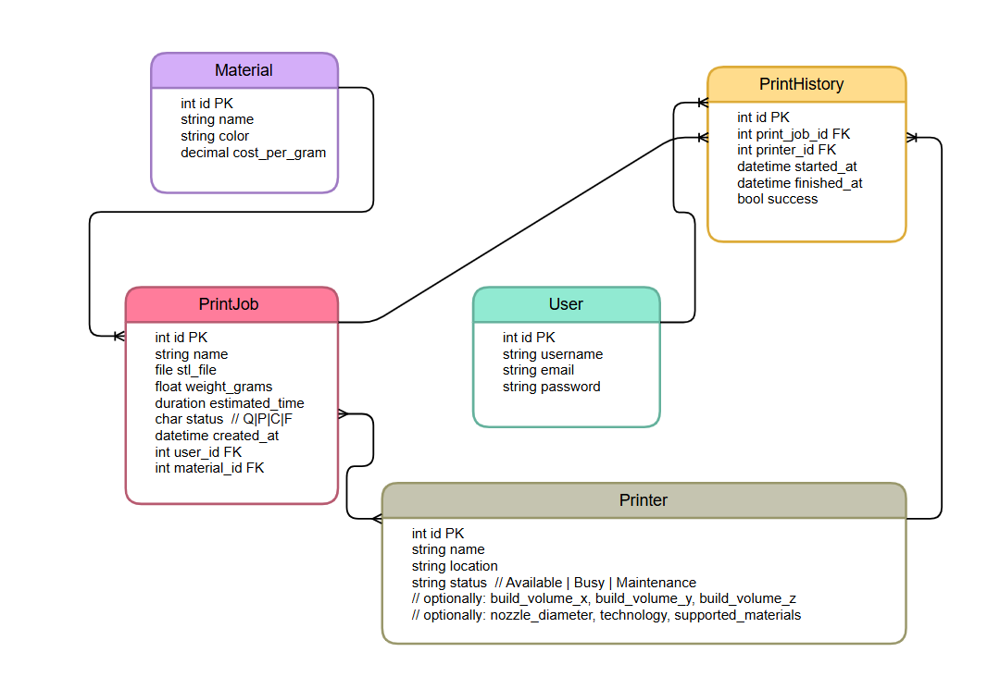

# FabriQueue  

  


FabriQueue is a Django web application that allows **lab managers, engineers, and makers** to manage **3D printing job queues**.  

Users can submit print jobs, upload STL files, assign materials, and track status from **Queued → In Progress → Completed**.  


The app automatically calculates **estimated cost per print (based on weight and material)** and **estimated print time**, while keeping a history of all jobs per user.  


This project reflects **real-world fabrication lab management systems** for 3D printers, CNC machines, and maker spaces.  


---


## ✨ Features

### 1. **User Management**

- Sign up, login, and logout with Django’s authentication.

- Each user manages their own queue of jobs.

- Superusers (admins) can view all jobs across the system.


---


### 2. **Print Job CRUD**

- Create, Read, Update, Delete jobs.

- Job attributes:

  - Name of the part

  - STL file upload

  - Material (linked to Material model)

  - Status (Queued, In Progress, Completed, Failed)

  - Estimated weight (grams)

  - Estimated print time

  - Auto-calculated cost (material × weight)


---


### 3. **Material Management**

- Add and manage materials (PLA, ABS, Resin, etc.).

- Attributes:

  - Name

  - Color

  - Cost per gram

- Materials are linked to jobs to calculate cost.


---


### 4. **Printer Management**

- Add and manage printers in the lab.

- Attributes:

  - Name

  - Location

  - Status (Available, Busy, Maintenance)

- Assign printers to jobs.


---


### 5. **Print Job History**

- Tracks job runs with:

  - Printer used

  - Start and finish times

  - Success/Failure result


---


### 6. **Dashboard**

- Overview of all jobs created by a user.

- Shows:

  - Print job list

  - Status filter

  - Costs and estimated times

- Admin dashboard shows **all jobs from all users**.


---


### 7. **Future Add-ons**

- STL preview (using Three.js).

- Live 3D printer monitoring via OctoPrint API.

- Notifications when jobs complete.

- Material stock management.


---


## Tech Stack


- **Backend:** Django 5.x, Python 3.11+  

- **Database:** SQLite (dev), PostgreSQL (production)  

- **Frontend:** HTML5, CSS3 (modular per feature), Django Templates  

- **File Handling:** Django FileField for STL uploads → `/media/stl_files/`  

- **Version Control:** Git + GitHub  


---


## Project Structure


```

UNIT_4_PROJECT/

 ┣ FabriQueue/                # Main project settings

 ┃ ┣ settings.py

 ┃ ┣ urls.py

 ┃ ┣ wsgi.py

 ┃ ┗ asgi.py

 ┣ my_app/                    # Core app

 ┃ ┣ migrations/

 ┃ ┣ static/

 ┃ ┃ ┣ css/                   # Modular CSS (by feature)

 ┃ ┃ ┃ ┣ dashboard/

 ┃ ┃ ┃ ┣ history/

 ┃ ┃ ┃ ┣ materials/

 ┃ ┃ ┃ ┣ printers/

 ┃ ┃ ┃ ┣ printjobs/

 ┃ ┃ ┃ ┣ about.css

 ┃ ┃ ┃ ┣ base.css

 ┃ ┃ ┃ ┣ form.css

 ┃ ┃ ┃ ┗ home.css

 ┃ ┃ ┗ images/

 ┃ ┃    ┣ background.jpeg

 ┃ ┃    ┣ logo.png

 ┃ ┃    ┗ welcome.jpeg

 ┃ ┣ templates/

 ┃ ┃ ┣ dashboard/

 ┃ ┃ ┣ history/

 ┃ ┃ ┣ materials/

 ┃ ┃ ┣ printers/

 ┃ ┃ ┣ printjobs/

 ┃ ┃ ┣ about.html

 ┃ ┃ ┣ base.html

 ┃ ┃ ┗ home.html

 ┃ ┣ models.py

 ┃ ┣ views.py

 ┃ ┣ urls.py

 ┃ ┗ forms.py

 ┣ stl_files/                 # Uploaded STL files

 ┣ manage.py

 ┣ Pipfile / requirements.txt

 ┗ README.md

```


---


## Models and ERD


### Models

- **User** (built-in Django auth)  

- **Material**: name, color, cost_per_gram  

- **Printer**: name, status, location  

- **PrintJob**: linked to User + Material + Printer(s)  

- **PrintHistory**: tracks job runs  


### Relationships

- `User` → `PrintJob` : One-to-Many  

- `Material` → `PrintJob` : One-to-Many  

- `Printer` → `PrintJob` : Many-to-Many  

- `PrintJob` → `PrintHistory` : One-to-Many  


---


### ERD Diagram


**ERD Diagram**





```
User 1 ────< PrintJob >───── Material
                 |
                 └───< PrintHistory >─── Printer

```

```
+----------------+         +------------------+
|     User       |         |     Material     |
+----------------+         +------------------+
| id (PK)        |         | id (PK)          |
| username       |         | name             |
| email          |         | type             |
| password       |         | cost_per_gram    |
+----------------+         +------------------+
        |
        | 1-to-Many
        v
+------------------+
|    PrintJob      |
+------------------+
| id (PK)          |
| name             |
| stl_file         |
| material_id (FK) |
| user_id (FK)     |
| status           |
| weight_grams     |
| est_time_minutes |
| created_at       |
+------------------+
        |
        | 1-to-Many
        v
+---------------------+
|   PrintHistory      |
+---------------------+
| id (PK)             |
| print_job_id (FK)   |
| printer_id (FK)     |
| started_at          |
| finished_at         |
| success             |
+---------------------+
        ^
        |
        | 1-to-Many
+------------------+
|     Printer      |
+------------------+
| id (PK)          |
| name             |
| location         |
| status           |
+------------------+

```

---


---


## Setup Instructions


```bash

# Clone repo

git clone https://github.com/your-username/fabriqueue.git

cd fabriqueue


# Create virtual environment

python -m venv venv

source venv/bin/activate  # Mac/Linux

venv\Scripts\activate     # Windows


# Install dependencies

pip install -r requirements.txt


# Apply migrations

python manage.py migrate


# Create superuser

python manage.py createsuperuser


# Run server

python manage.py runserver

```


👉 Open [http://127.0.0.1:8000](http://127.0.0.1:8000/)  


---


## Why FabriQueue?


- Designed for **labs, universities, and makerspaces**.  

- Helps organize **3D printing workflows**.  

- Expandable to CNC, laser cutters, and other digital fabrication tools.  


---


##  License

Educational project for General Assembly SEI Unit 4.  

Feel free to fork and expand.  


---


💡 *FabriQueue – Where every print has its place.*